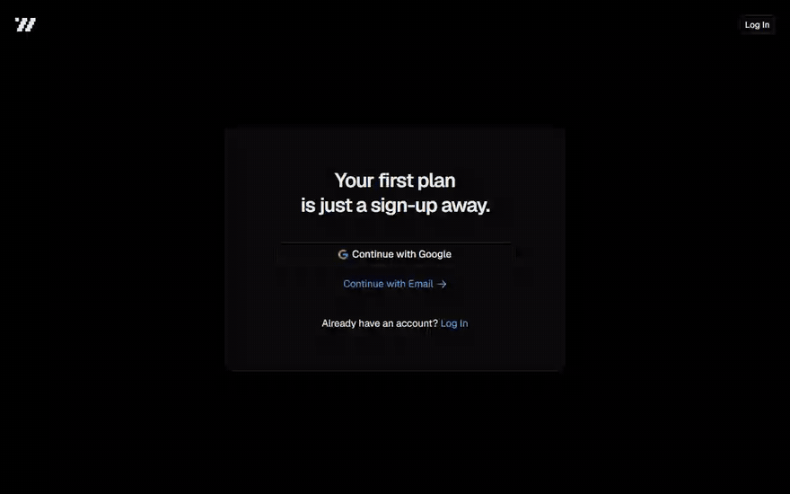
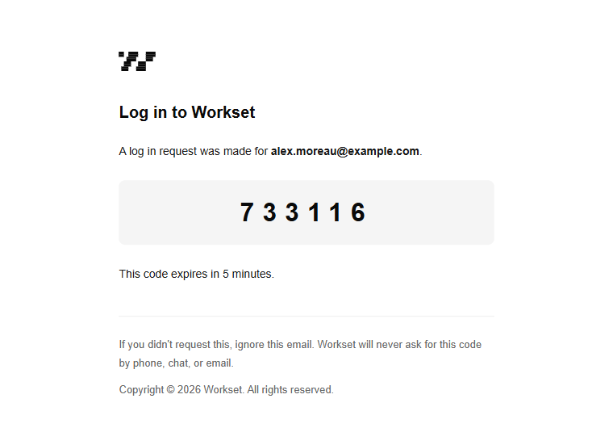
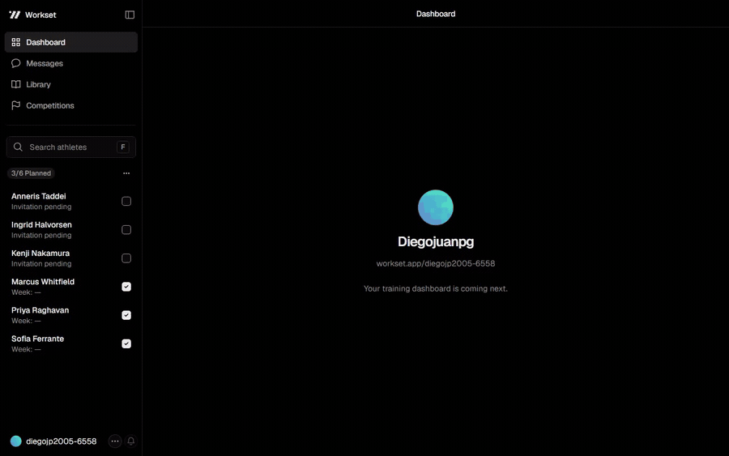
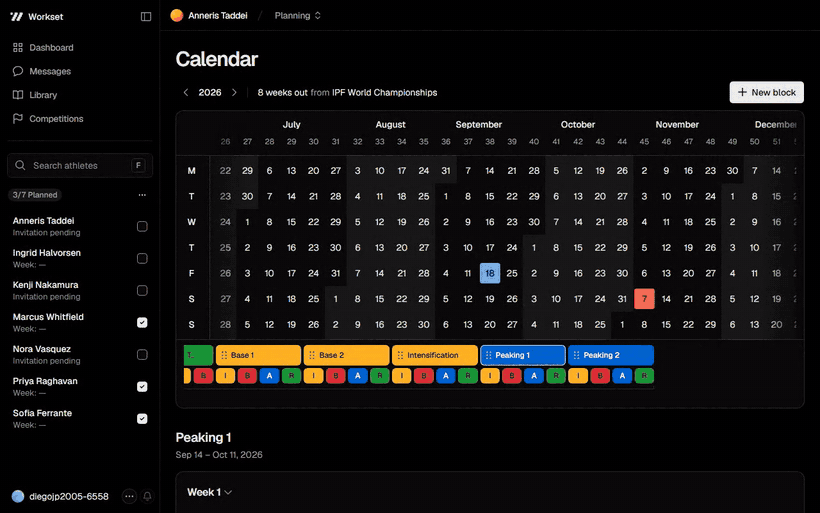
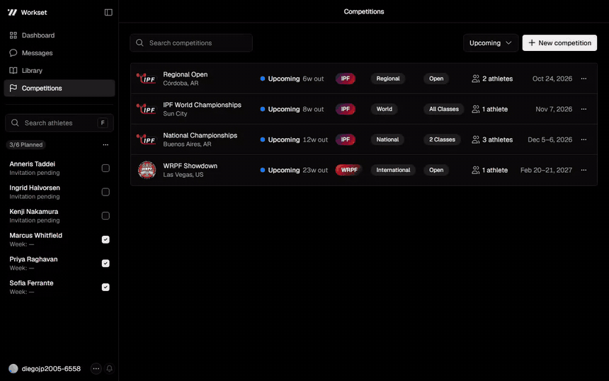
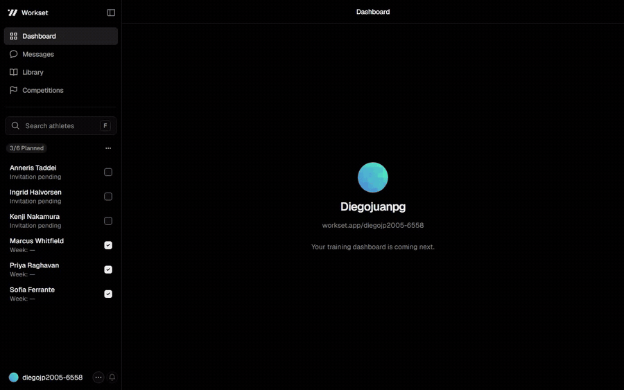

<div align="center">
  <h1>Workset</h1>
  <p><strong>Planificación de entrenamiento y análisis de datos, en un solo lugar.</strong></p>
  <p>
    <a href="https://github.com/diegojuanpg/workset/actions/workflows/ci.yml"></a>
    
    
    
    
    
  </p>
</div>

---

Workset es una app enfocada a entrenadores de powerlifting, halterofilia y bodybuilding. La
idea es tener un entorno que permita planificar el entrenamiento de forma más rápida y un
ecosistema donde se puedan analizar los datos. La construyo de a poco, en mis tiempos libres.


## La app

Todo lo que sigue está grabado sobre la app corriendo.

### Crear cuenta



### El mail con el código



### Configurar la cuenta


### Iniciar sesión


### Secciones



### Buscador de atletas


### Agregar un atleta


### Calendario anual



### Competencias



### Configuración


### Secciones del atleta


### Menú de cuenta



### El atleta entra por el link de invitación


## Arquitectura

```
src/
├── app/                      App Router: rutas, layouts y Server Actions
│   ├── [username]/           namespace del coach (athletes, competitions, settings, …)
│   ├── athlete/              el lado del atleta
│   ├── join/[token]/         reclamo del link de invitación
│   ├── login · signup · onboarding · auth/callback
│   └── home/                 landing pública
├── components/               UI (calendar, panel, competitions, settings, ui/)
├── lib/                      lógica de dominio y acceso a datos
│   ├── blocks/ cycles/ competitions/ athletes/   queries + actions + reglas puras
│   └── supabase/             clientes tipados (browser / server)
└── proxy.ts                  middleware: refresh de sesión y guardias de ruta

supabase/migrations/          16 migraciones — schema, RLS, triggers y constraints
docs/project-index.md         mapa vivo del código: qué existe, dónde vive, cómo funciona
DESIGN.md                     el sistema de diseño escrito (tokens, tipografía, materiales)
```

**Server Components por defecto.** Los datos se leen en el servidor; solo el calendario, los
modales y los formularios son cliente. Las páginas que dependen de varias fuentes las piden en
paralelo (`Promise.all`) en lugar de encadenar awaits.

**Server Actions para escribir.** Cada action valida la sesión antes de tocar la base — la RLS
es la segunda línea, no la única.

**El invariante vive en Postgres, no en el cliente.** Dos bloques del mismo atleta no pueden
solaparse: eso es un `EXCLUDE USING gist` sobre `daterange`, no un `if` en React. Un bloque
arranca lunes, termina domingo y dura semanas enteras: tres `CHECK`. La UI valida para dar
buenos mensajes; la base valida para que sea cierto.

**RLS estricta.** Cada tabla tiene su policy y los grants son por columna: el Postgres de
Supabase no otorga nada por defecto y acá tampoco.

**Rol dual.** Un usuario puede ser coach y atleta a la vez. No hay columna `role`: las
capacidades se derivan de los datos (`profiles.is_coach` y la existencia de una fila en
`athlete_profiles`). Un atleta puede tener varios coaches — cada vínculo es una fila propia.

**Invitaciones.** El coach crea al atleta con un nombre temporal y comparte `/join/{token}`.
El token es single-use, expira a los 7 días, y al reclamarse la fila pendiente se convierte en
una membresía real sin perder la planificación ya cargada.
