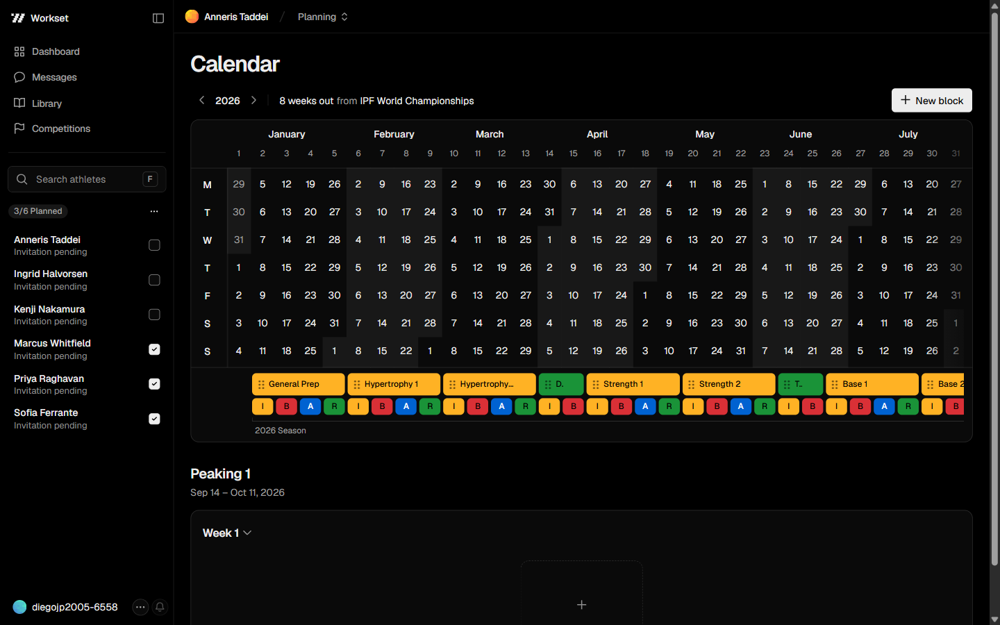
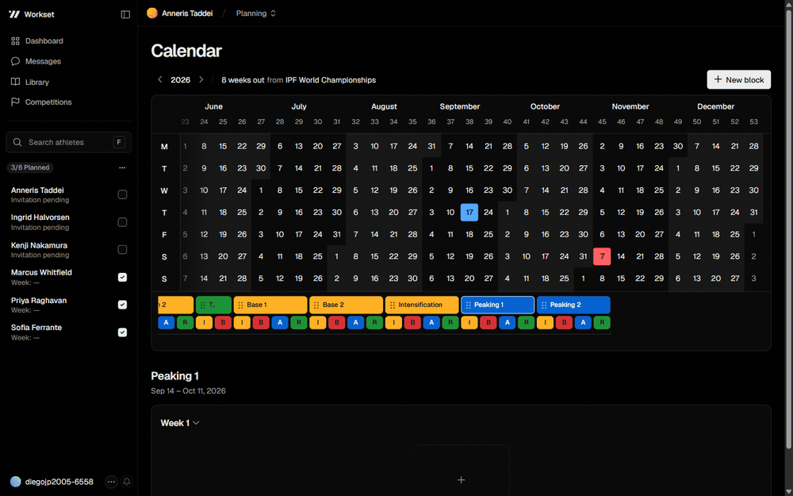
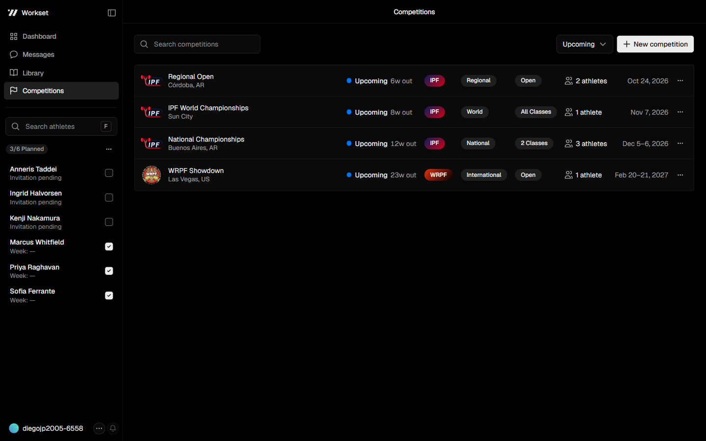
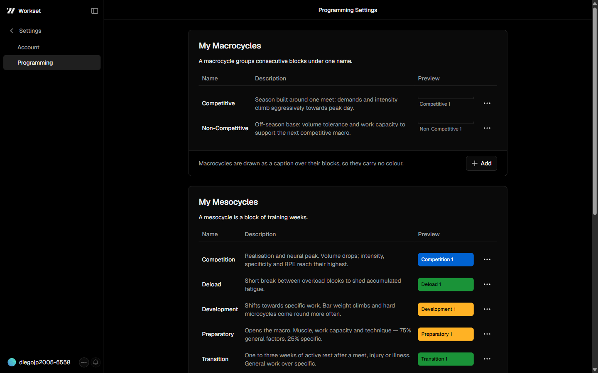
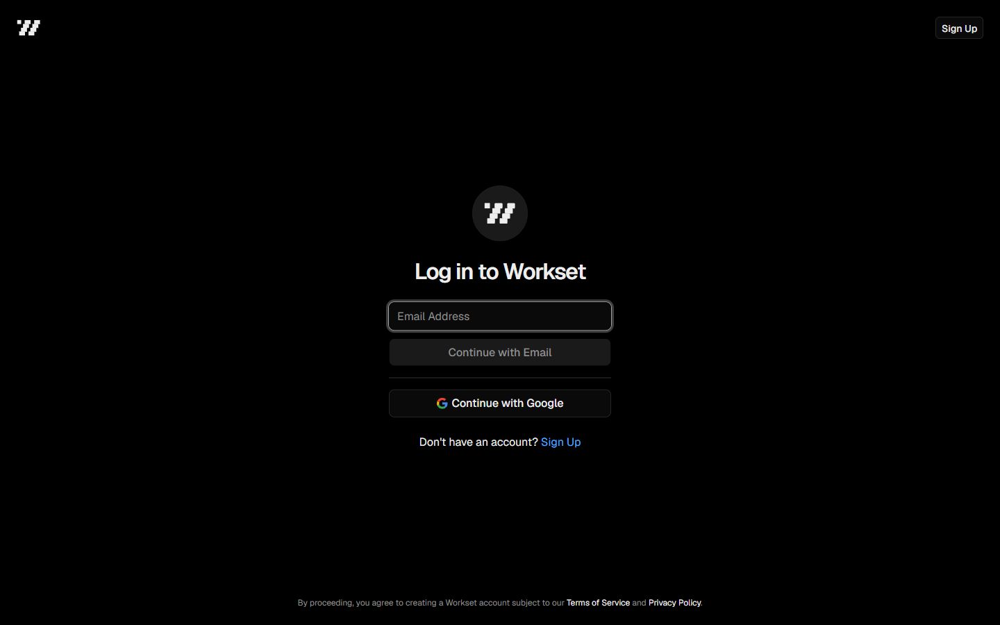

<div align="center">
  
  
  <h1>Workset</h1>
  <p><strong>Planificador de entrenamiento de fuerza para coaches y sus atletas.</strong></p>
  <p><em>Proyecto personal. Lo construyo de a poco, en el tiempo que me queda libre.</em></p>
  <p>
    <a href="https://github.com/diegojuanpg/workset/actions/workflows/ci.yml"></a>
    
    
    
    
    
  </p>
</div>

---

Un coach de fuerza planifica la temporada de cada atleta en bloques de semanas: preparación,
desarrollo, deload, pico de competencia. Hoy eso vive en planillas de Excel que nadie puede
compartir y que no saben qué es una semana, un mesociclo ni una fecha de competencia.

Workset es esa planificación llevada a una app: un calendario anual donde el bloque es la
unidad de trabajo, las competencias son fechas fijas alrededor de las cuales se ordena todo, y
el atleta entra con su propia cuenta a ver lo que le toca.

Es un proyecto personal que vengo construyendo de a poco, a mi ritmo y en el tiempo que me
queda libre. Sin equipo, sin deadline y sin apuro: cada feature entra cuando está bien
resuelta. Eso también explica el criterio del código — cuando algo se puede hacer bien o se
puede hacer rápido, acá se hizo bien.

## La app

### Calendario anual

El año completo en una grilla de 53 semanas: días arriba, la banda de bloques abajo, los
mesociclos coloreados y una letra por semana (Intro, Build, Attack, Recover). La competencia
marca el día en rojo y el header cuenta cuántas semanas faltan.



### Dibujar un bloque

Doble click en una semana, el rango sigue al cursor con el mouse suelto, un click lo cierra.
El modal abre con las fechas y la duración ya resueltas por el gesto. Si el rango pisa otro
bloque, la app lo dice durante el gesto, antes de abrir un formulario que no va a poder
guardar.



### Competencias

Federación, tipo, categorías y atletas inscriptos por competencia, ordenadas por cuánto falta.



### Ciclos configurables

Los tipos de macro, meso y microciclo son del coach, no del producto: nombre, descripción y
color propios, con el preview de cómo van a verse en el calendario.



### Auth sin contraseñas

Código de 6 dígitos por email o Google OAuth. No existen contraseñas en el sistema.



## Arquitectura

```
src/
├── app/                      App Router: rutas, layouts y Server Actions
│   ├── [username]/           namespace del coach (athletes, competitions, settings, …)
│   ├── athlete/              el lado del atleta
│   ├── join/[token]/         reclamo del link de invitación
│   ├── login · signup · onboarding · auth/callback
│   └── home/                 landing pública
├── components/               UI (calendar, panel, competitions, settings, ui/)
├── lib/                      lógica de dominio y acceso a datos
│   ├── blocks/ cycles/ competitions/ athletes/   queries + actions + reglas puras
│   └── supabase/             clientes tipados (browser / server)
└── proxy.ts                  middleware: refresh de sesión y guardias de ruta

supabase/migrations/          16 migraciones — schema, RLS, triggers y constraints
docs/project-index.md         mapa vivo del código: qué existe, dónde vive, cómo funciona
DESIGN.md                     el sistema de diseño escrito (tokens, tipografía, materiales)
```

**Server Components por defecto.** Los datos se leen en el servidor; solo el calendario, los
modales y los formularios son cliente. Las páginas que dependen de varias fuentes las piden en
paralelo (`Promise.all`) en lugar de encadenar awaits.

**Server Actions para escribir.** Cada action valida la sesión antes de tocar la base — la RLS
es la segunda línea, no la única.

**El invariante vive en Postgres, no en el cliente.** Dos bloques del mismo atleta no pueden
solaparse: eso es un `EXCLUDE USING gist` sobre `daterange`, no un `if` en React. Un bloque
arranca lunes, termina domingo y dura semanas enteras: tres `CHECK`. La UI valida para dar
buenos mensajes; la base valida para que sea cierto.

**RLS estricta.** Cada tabla tiene su policy y los grants son por columna: el Postgres de
Supabase no otorga nada por defecto y acá tampoco.

**Rol dual.** Un usuario puede ser coach y atleta a la vez. No hay columna `role`: las
capacidades se derivan de los datos (`profiles.is_coach` y la existencia de una fila en
`athlete_profiles`). Un atleta puede tener varios coaches — cada vínculo es una fila propia.

**Invitaciones.** El coach crea al atleta con un nombre temporal y comparte `/join/{token}`.
El token es single-use, expira a los 7 días, y al reclamarse la fila pendiente se convierte en
una membresía real sin perder la planificación ya cargada.

## Decisiones que vale la pena mirar

| Decisión | Dónde | Por qué |
|---|---|---|
| Dibujar con dos clicks, no arrastrando | `src/components/calendar/year-calendar.tsx` | Mantener el botón apretado a lo largo de 20 columnas es pedirle mucho a una mano, y un resbalón termina el gesto donde la mano aflojó. |
| El rechazo se responde durante el gesto | `year-calendar.tsx`, `draftRefusal` | Abrir un formulario cuyo botón ya está deshabilitado obliga al coach a adivinar qué hizo mal. |
| Un solo tab stop para toda la grilla | `year-calendar.tsx`, `tab(d, wi)` | 371 celdas serían 371 paradas de tabulador: una trampa, no accesibilidad. Las flechas caminan la grilla. |
| Lógica pura separada de React | `src/lib/blocks/`, `src/lib/calendar/` | Semanas, orden, nombres y fechas se testean sin montar un componente. 80 tests, 3s. |
| Tokens `--ds-*`, cero hex sueltos | `src/app/geist-*.css`, `DESIGN.md` | El tema oscuro no es un set de overrides `dark:`: es el mismo token resuelto distinto. |

## Correr el proyecto

Requisitos: Node 20+, pnpm y Docker (para el Supabase local).

```bash
pnpm install
cp .env.example .env.local

pnpm exec supabase start   # levanta Postgres, Auth, Storage y Mailpit
# copiar la anon key que imprime a .env.local

pnpm dev                   # http://localhost:3000
```

Los mails (el código de 6 dígitos incluido) quedan capturados en Mailpit —
`http://localhost:54324`. Studio en `http://localhost:54323`.

```bash
pnpm test    # Vitest — 80 tests
pnpm check   # lint + typecheck + build
```

## Estado

Avanza de a poco, sin fecha de entrega — es lo que hago cuando tengo un rato.

**Terminado:** auth passwordless, cuentas de atleta con invitaciones, competencias, calendario
anual con bloques, macro/meso/microciclos y tipos configurables.
**En curso:** el planner de sesiones dentro de cada semana.
**Pendiente:** landing pública, biblioteca de ejercicios y mensajería.

El mapa completo del código, feature por feature, está en
[`docs/project-index.md`](docs/project-index.md).
